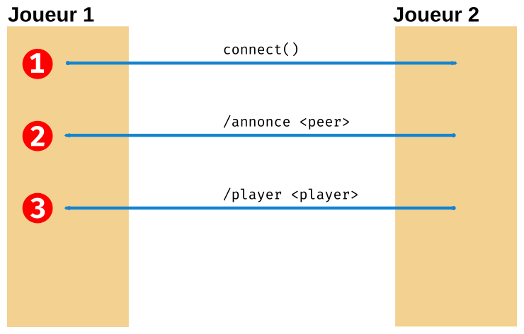

# Projet de Programmation réseau - Rapport
Dans le cadre du cours de réseau de la licence pro ADSILLH, il est demandé de
transformer le code d'un jeu en Python pour le mettre en réseau par groupe de
deux au moyen de nos connaissances.

Ce rapport est rédigé par Yorick Barbanneau et Luc Lauriou.

## Sommaire

- Fonctionnalités apportées
- Déroulement
- Choix techniques et difficultés rencontrées
  - Mode de communication "serverless"
  - Obfuscation des mouvements et triche
  - Signal et Thread
- Sources
- Annexes

## Fonctionnalités apportées

Notre solution embarque comme nouvelles fonctionnalités, par rapport au code
fourni, le multijoueur en réseau à deux ou à trois avec la possibilité
d'incarner le serpent et l'obfuscation des messages de mouvement pour éviter la
triche.

## Déroulement

Comme point de départ, la fonction `select` de Python placée dans la boucle
infinie du jeu semblait intéressante. Cependant, l'appel de
`pygame.event.wait` étant bloquant dans cette boucle, il a été décidé de créer
un thread parallèle contenant ce select et écoutant les sockets pour éviter
d'éventuels problèmes à venir, en prenant pour exemple la façon dont
fonctionnent d'autres outils du monde du jeu vidéo : une boucle, chargée de
l'affichage, effectue le moins d'actualisations possible, avec comme limite
maximum, de préférence, le taux de rafraichissement du moniteur qui affiche le
jeu, et une boucle, chargée d'effectuer d'autres calculs, actualisée le plus
souvent possible.

Une première version du code plaçait un des joueurs en position d'hôte et les
autres joueurs en position de clients. L'hôte se chargeait de centraliser les
informations et de les renvoyer aux différents hôtes. On a ensuite développé une
deuxième version sans serveur central nous permettant régler certaines
contraites dues à la mise en place d'un mode à plus de deux joueurs.

Ensuite, on a effectué la mise en place des module, pour jouer avec le serpent
et pour chiffrer les mouvements, limitant ainsi la triche. Bien que,
jusqu'alors, la présence d'un `select` dans le thread ne s'avérait pas
nécessaire car, étant seulement 2 joueurs, chacun n'avait qu'un socket à
surveiller (celui de l'opposant), elle devient maintenant indispensable.

## Choix techniques et difficultés rencontrées

### Mode de communication "serverless"

Permettre un mode de jeu réseau pour plus de deux joueur sans serveur central
fut difficile. Le fait d'avoir des joueurs définis (Adam, Eve et le Serpent) en
rajoute une couche. Il nous a fallu définir un protocole d'échange
d'informations entre pairs précis :



 1. Le joueur 1 se connecte au joueur 2 qui accepte la connexion.
 2. Le joueur 2 envoi la liste des joueurs auxquels il est connecté par des
    messages `/peer <adresse:port>`. Le joueur 1 ne traitera les messages
    `/peer` venant seulement du joueur 2
 3. Le joueur 2 envoi le personnage qu'il joue par un message `/player <name>`

Le joueur 1 ignorera toutes les requêtes `/peer` sauf celles venant du joueur 2
afin d'éviter les problèmes de connexion infinie ( 1 -> 2 -> 3 -> 2 ->3 etc.).

Avec ce mode de communication, chacun des joueurs possèdent une version du
modèle de données en local et effectue les modifications sur celui-ci. Ce
fonctionnement nous a inévitablement amené à rencontrer de nombreux bugs car les
données pouvaient être différentes selon les clients. C'est pourquoi il a fallu
s'assurer que chaque joueur distant avait effectué un mouvement avant de pouvoir
en rejouer un autre. Bien entendu, la mise en place du module d'obfuscation rend
véritablement nécessaire cette vérification étant donné que la clé de
déchiffrement ne doit être envoyée une fois les mouvemments de tous les joueur
annoncés.

Le code réseau pour connecter les pairs entre eux, annoncer les pairs, et
vérifier les mouvenment a été testé indépendemment du jeux. Il nous a permis de
tester tout celà avec 4 pais connecté en même temps, même si pour les besoins du
jeu 3 suffisents.

### Obfuscation des mouvements et triche

L'obfuscation est obtenue en appliquant la fonction `crypt.crypt()`. La mise en
œuvre de cette fonctionnalité est bien plus subtile qu'il n'y parraît.

#### Utiliser un sel "fort"

Afin de créer un sel permettant un chiffrement fort du message et éviter ainsi
une attaque par *bruteforce*, nous avons utilisé la fonction `crypt.mksalt()` de
la façon suivante :

```python
key = crypt.mksalt(crypt.METHOD_SHA256)
```

#### Envoyer seulement le message hashé

la fonction `crypt.crypt()` retourne une chaîne de caractères reprenant le sel
puis le message hashé. En envoyant l'ensemble de cette chaîne, les adversaires
seraient en mesure de déchiffrer le message facilement. Il faut donc envoyer
seulement la partie hashée du message :

```python
msg = crypt.crypt( current_user['move'], current_user['key']).split('$')[3]
create_message(0,msg)
```
Voir l'annexe 1 pour une PoC

#### Changer la clé à chaque tour

Comme la vérification des messages nécessite l'envoi du sel aux adversaires, il
pourraient essayer de déchiffrer les message suivants avec la clé obtenue. Il
est donc nécessaire de changer la clé à chaque tour.

### Signal et Thread

Afin de prendre en compte le signal SIGINT avec notre thread réseau, nous avons
du chercher du côté de la gestion de signal en Python. Plusieurs facteurs
faisait que ça ne se passait pas comme prévu : 

 - Le signal `SIGINT` était reçu par le thread principal qui ne le répercuttait
     pas sur le thread réseau.
 - Une fois une fonction de gestion des signaux mise en place pour gérer l'arrêt
     du thread réseau, il nous restait un cas particulier. L'appel de
     `select.select()` est bloquant tant qu'il n'y a pas de donnée reçue, donc
     pas de gestion du signal. Il est cependant possible de rendre cet appel
     non-bloquant avec `select.select([], [], [], 0)` entrainant cependant une
     hausse de la consommation de temps CPU lors de l'attente de donnée.

## Sources

La majorité du code a été rédigée à l'aide de la documentation Python et de nos
connaissances personnelles. Le support de Stackoverflow a été utile pour trouver
des concepts natifs à Python ou des façons de faire (ex : comment séparer une
chaine de caractères), mais aucune fonction ou de partie de code n'a été
copiée.

L'aide d'**iPython** a aussi été précieuse notamment pour les opérations sur les
variables (comparaison de dictionnaires ou de listes, découpages de chaines avec
des *regex* etc.). Il nous a aussi permis de tester rapidement des bout de code et de
comprendre le foctionnement de certaines fonctions comme `crypt.mksalt()` par
exemple.

## Conclusion

Avec ce projet, nous avons pu découvrir Python un plus en profondeur et
entrevoir les possibilités de ce langage. Sa librairie standard bien fournie,
ses type de variable très pratiques (tuples, dictionnaires, listes) et les
nombreux modules disponnibles en font un langage de choix qui mérite sa solide
réputation.

Le projet nous a permis de mettre un pied dans la programmation réseau d'en
cerner les problèmes, d'immaginer des solutions. Nous avons délibérément choisit
de m'intégrer que peu de fonctionnalité, mais pour se concentrer sur
l'implémentation d'un système complètement acentré nécessitant plus de travail
de fond.

Nous pourrions cependant améliorer certains points :

 - simplifier la gestion des messages entre joueurs en particulier pour
     l'annonce des pairs. Il serait possible, par exemple, de gerer les
     messages entrants avec une `Queue()` afin de permettre une gestion
     d'annonce des pairs plus globale (depuis tous les pairs et non pas depuis
     le premier uniquement)
 - Travailler sur l'optimisation générale afin de réduire son empreinte sur le
     temps CPU.

## Annexes

### Annexe 1

Petit programme python permettant de déchiffrer un message contenant l'ensemble
de la chaîne résultant de  la fonction `crypt.crypy()`

```python
#!/bin/python
import sys
import crypt

mhash = input("Enter hash to analyse : ")
key = mhash.split('$')[2]
method = mhash.split('$')[1]
for i in ['LEFT', 'DOWN', 'UP', 'RIGHT']:
    test = crypt.crypt(i, '$' + method + '$' + key)
    if test == mhash:
        print('Played: %s' % (i))
        break
```

### Annexe 2

Petit programme en python permettant de déchiffer les messages envoyés par un
jouer s'il ne change pas de sel cryptographique.

```python
#!/bin/python
import sys
import crypt

mhash = input("Enter hash to analyse : ")
key = input("Enter the key : ")

for i in ['LEFT', 'DOWN', 'UP', 'RIGHT']:
    test = crypt.crypt(i, key).split('$')[3]
    if test == mhash:
        print('Played: %s' % (i))
        break
```
